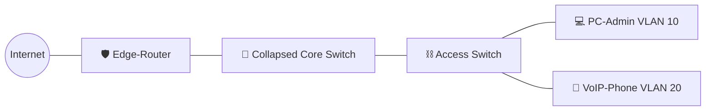

# 🏥 Lab-01: Small Office Collapsed Core
*Building the Foundational Network (2012 Legacy)*

## 📖 The Origin Story: Layer 1 to Layer 7
From 2012 to 2019, I built and managed company-owned data centers from the ground up—not as a cloud consumer, but as the person running the cables, racking the servers, and configuring the silicon. This lab represents the start of that journey: the day I was handed a Cisco router and a one-week deadline to build a functional medical office network with zero mentors.

This is a recreation of that "Baptism by Fire" moment, demonstrating the foundational networking principles I mastered before transitioning to the world of Cloud and GitOps.

## 🏗️ Architecture Diagram
This topology represents a classic small-office design where the Core and Distribution layers are combined into a single logical "Collapsed Core".



## 🧠 Design Decisions
*   **Collapsed Core Model**: Chosen for cost-effectiveness and simplified management in a small-office footprint.
*   **802.1Q VLAN Tagging**: Implemented to isolate administrative traffic (VLAN 10) from VoIP traffic (VLAN 20) for security and QoS.
*   **Inter-VLAN Routing**: Configured on the Core-Switch to allow controlled communication between segments without hair-pinning traffic to the Edge Router.
*   **DHCP & NAT**: Offloaded to the Edge-Router to preserve switch resources and centralize gateway services.

## 🚀 Deployment Steps
1.  **Clone the Repository** and navigate to `lab-01-small-office-collapsed-core`.
2.  **Spin up the Virtual Infrastructure**:
    ```bash
    vagrant up
    ```
    *Note: This lab is lightweight and runs comfortably on 8GB RAM.*
3.  **Verify the Services**:
    *   `vagrant ssh edge-router`: Check DHCP pools and NAT translations.
    *   `vagrant ssh core-switch`: Verify VLAN database and routing table.

## 🎓 Lessons Learned
*   **Grit over Theory**: Learned that documentation is your best friend when mentors are absent.
*   **Segmentation is Security**: Realized early that flat networks are a liability; VLANs are the first line of defense.
*   **Resource Efficiency**: Mastered the art of choosing the right model (Collapsed Core) for the right scale.