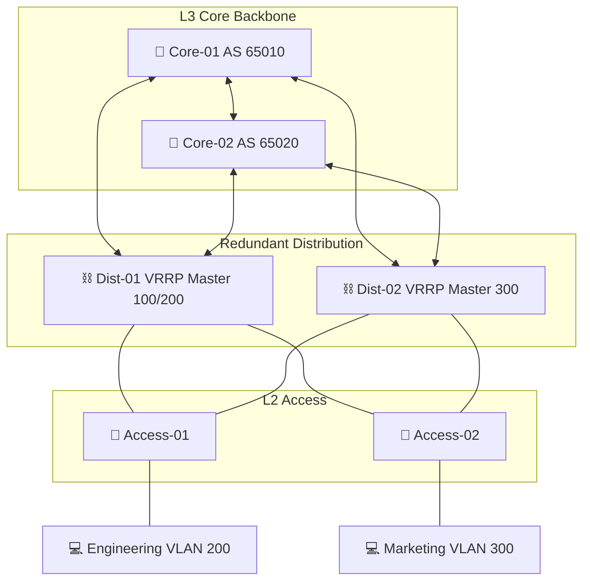

# 🏢 Lab-02: Campus Enterprise Core-Dist-Access
*Scaling for Resilience and High-Availability*

## 📖 The Scaling Story: Scaling for Resilience
As my career progressed between 2012 and 2019, the "one-switch office" evolved into enterprise-scale campus environments. I moved from physical racking to designing mission-critical architectures where a single hardware failure could no longer be an option.

This lab demonstrates that transition, implementing the traditional 3-tier Hierarchical Model (Core, Distribution, Access) used in the company-owned data centers I used to build and maintain.

## 🏗️ Architecture Diagram
This 10-VM lab features a fully redundant mesh with sub-second failover capabilities.



## 🧠 Design Decisions
*   **3-Tier Hierarchy**: Separating Core (L3/BGP), Distribution (Aggregation/VRRP), and Access (User-facing) for deterministic scalability.
*   **VRRP (First-Hop Redundancy)**: Ensures users have a redundant gateway. If `dist-01` fails, `dist-02` takes over the Virtual IP instantly.
*   **LACP (EtherChannel)**: Aggregating multiple links between Access and Distribution to provide both increased bandwidth and hardware-level resilience.
*   **BGP Mesh Core**: Using unique Autonomous Systems for the Core backbone to simulate real-world ISP or large Campus transit.

## 🚀 Deployment Steps
1.  **Navigate** to `lab-02-campus-enterprise-core-dist-access`.
2.  **Fire up the Campus**:
    ```bash
    vagrant up
    ```
    *Note: Requires 12GB+ RAM available.*
3.  **Run the "Chaos" Tests**:
    *   **VRRP Failover**: `ping 10.0.200.1` from `eng-workstation` while running `vagrant halt dist-01`.
    *   **Core Convergence**: Shut down `core-01` and verify routing persists via `core-02`.

## 🧪 Technical Highlights
*   **CCNP-Grade Configuration**: Features VyOS implementations of VRRP, LACP, and BGP.
*   **Sub-sub-second Failover**: Optimized for uptime.
*   **Redundant Uplinks**: Every layer has at least two paths to its neighbor.

## 🎓 Lessons Learned
*   **Complexity vs. Reliability**: Redundancy adds configuration overhead but is non-negotiable for enterprise stability.
*   **Predictable Traffic Flow**: Learned to steer traffic using VRRP priorities and BGP metrics.
*   **Monitoring is Key**: In a redundant network, a failure might go unnoticed without proper alerting.


